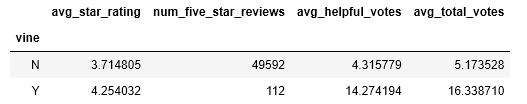

# Product Review Analysis

## **Objective:**
The objective of this project is to use PySpark, SQLAlchemy, and Pandas to extract, transform, and load Amazon product review data into an AWS RDS database and to investigate whether Amazon Vine reviews are biased. Customers who have a reputation for writing helpful reviews and for expertise in specific product categories are invited to participate in Amazon's Vine program. These reviewers receive free products in exchange for reviews. For this project, product reviews for mobile electronics and major appliances were examined by comparing the average star rating, number of five-star reviews, number of helpful votes, and total number of votes between Vine and non-Vine reviews. 

## **Tools:**
1. Python - PySpark, Pandas, SQLAlchemy

## **Data Sources:**
Amazon Product Reviews: https://s3.amazonaws.com/amazon-reviews-pds/tsv/index.txt
    
## **Screenshots:**
Product Review Summary - Mobile Electronics

Product Review Summary - Major Appliances

